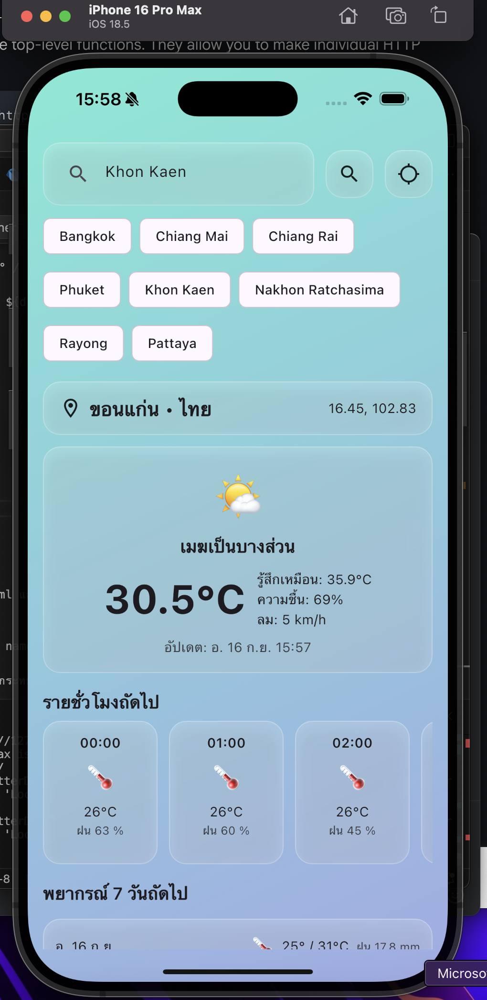
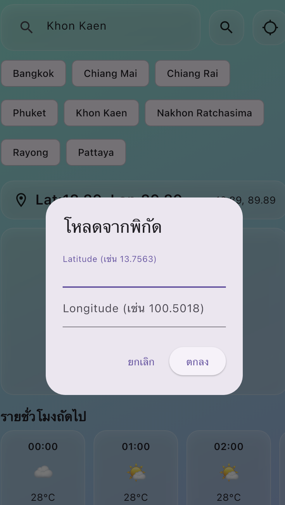
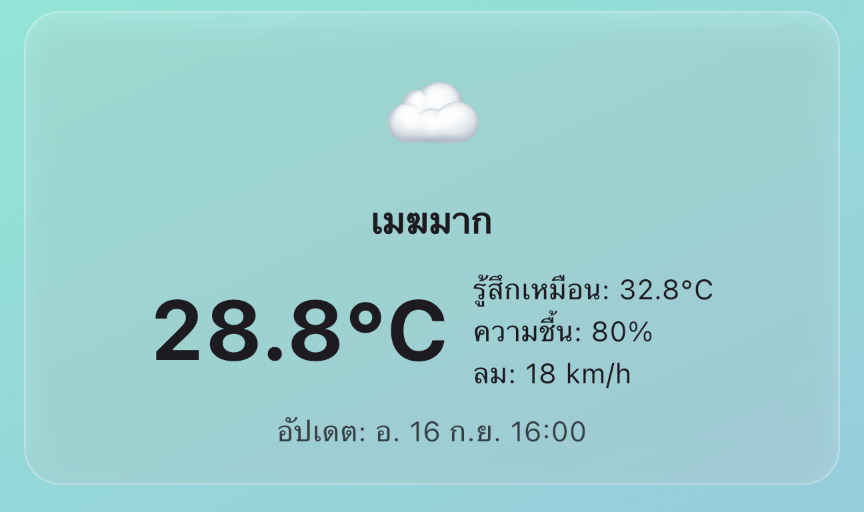
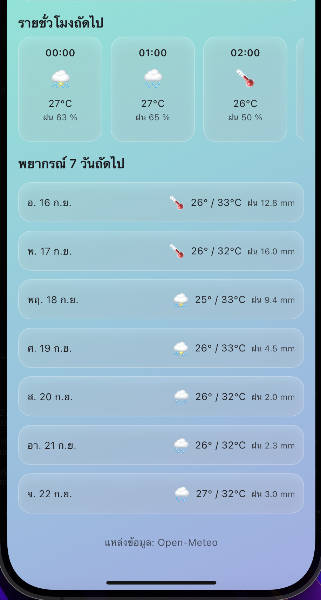
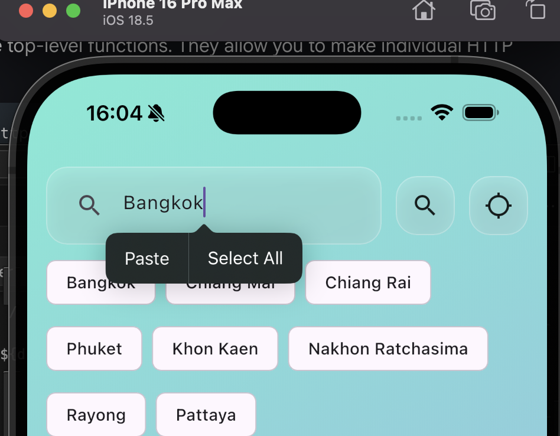

README — แอพสภาพอากาศ (Flutter + http + provider + Open-Meteo)

โปรเจกต์ตัวอย่างนี้สาธิตการดึง สภาพอากาศปัจจุบัน / รายชั่วโมง / รายวัน 7 วัน จาก Open-Meteo API แล้วแสดงผลด้วย Flutter โดยแยกเป็นชั้น data / models / services / providers / UI อย่างเป็นระเบียบ พร้อมปุ่มกรอก latitude/longitude เพื่อเปลี่ยนพิกัดได้ทันที

สารบัญ

โครงสร้างโปรเจกต์

ติดตั้งและรัน

ศึกษาการใช้งาน API จาก URL

การใช้งานข้อมูลจาก API และการสร้างคลาสข้อมูล (Models)

หลักการใช้งาน http และ provider

การนำ http และ provider มาใช้งานในแอป

ออกแบบหน้าแอปและส่วนแสดงผล

อธิบายโค้ดอย่างละเอียด

โค้ดเต็ม (5 ไฟล์)

Troubleshooting ที่พบบ่อย

ต่อยอดฟีเจอร์

โครงสร้างโปรเจกต์
lib/
  data/
    th_cities.dart            # รายชื่อเมืองปุ่มลัด
  models/
    weather_models.dart       # City, HourlyForecast, DailyForecast, WeatherData
  services/
    weather_service.dart      # เรียก API + map JSON -> models
  providers/
    weather_provider.dart     # ChangeNotifier: state + actions
  main.dart                   # UI: ค้นหา / ปัจจุบัน / รายชั่วโมง / รายวัน + เปลี่ยนพิกัด

แยกชั้นชัดเจน:
Service คุย API → Provider จัดการ state → UI listen state และแสดงผล

ติดตั้งและรัน

pubspec.yaml (เฉพาะ dependencies สำคัญ)

dependencies:
  flutter:
    sdk: flutter
  http: ^1.2.2
  provider: ^6.1.2
  intl: ^0.19.0

อนุญาตอินเทอร์เน็ต (Android)
android/app/src/main/AndroidManifest.xml (นอก <application>)

<uses-permission android:name="android.permission.INTERNET" />

ติดตั้งแพ็กเกจ

flutter pub get

รัน

flutter run

ศึกษาการใช้งาน API จาก URL

เราใช้ Open-Meteo 2 จุดหลัก:

Geocoding (ค้นหาเมือง → lat/lon)
https://geocoding-api.open-meteo.com/v1/search?name=Bangkok&count=1&language=th&format=json

ตัวอย่างผลลัพธ์สำคัญ:

{
  "results": [
    {
      "name": "Bangkok",
      "country": "Thailand",
      "latitude": 13.75398,
      "longitude": 100.50144
    }
  ]
}

Forecast (พยากรณ์)
https://api.open-meteo.com/v1/forecast?latitude=13.75&longitude=100.50&current=temperature_2m,relative_humidity_2m,apparent_temperature,is_day,weather_code,wind_speed_10m&hourly=temperature_2m,apparent_temperature,weather_code,precipitation_probability,wind_speed_10m&daily=temperature_2m_max,temperature_2m_min,weather_code,precipitation_sum&timezone=auto

ฟิลด์สำคัญ:

current.* → ค่าปัจจุบัน (อุณหภูมิ, ความชื้น, รหัสสภาพอากาศ, ลม, ฯลฯ)

hourly.time, hourly.temperature_2m, hourly.weather_code, …

daily.time, daily.temperature_2m_max, daily.temperature_2m_min, daily.weather_code, daily.precipitation_sum

หมายเหตุ: weather_code ใช้มาตรฐาน WMO (เรา map เป็นข้อความ/emoji ใน service)

การใช้งานข้อมูลจาก API และการสร้างคลาสข้อมูล (Models)

เราออกแบบโมเดลให้ตรงกับสิ่งที่จะแสดงผล:

City — ชื่อเมือง/ประเทศ/พิกัด

HourlyForecast — เวลา, อุณหภูมิ, โค้ดอากาศ, โอกาสฝน, ลม, feels-like

DailyForecast — วันที่, สูงสุด/ต่ำสุด, โค้ดอากาศ, ปริมาณฝนรวม

WeatherData — รวม current + hourly list + daily list ไว้ที่เดียว

ข้อดี:

UI ใช้งานง่าย (ไม่ต้องรู้ JSON structure ของ API)

Service เป็นผู้ดูแล mapping/normalize ที่เดียว

หลักการใช้งาน http และ provider
http

ใช้ http.get(Uri.parse(url)) แบบ async (await)

เช็ค statusCode == 200 ก่อน parse

แยกชั้นเรียก API ใน WeatherService เพื่อความเป็นระเบียบ/ทดสอบง่าย

provider

ใช้ ChangeNotifier เป็น state manager เบาๆ

WeatherProvider เก็บ state: city, weather, loading, error

เรียก notifyListeners() หลังอัพเดต เพื่อให้ UI rebuild

UI ใช้ context.watch<WeatherProvider>() หรือ Consumer<WeatherProvider>() เพื่อฟัง state

การนำ http และ provider มาใช้งานในแอป

Flow หลัก:

ผู้ใช้พิมพ์ชื่อเมือง → provider.searchAndLoad(name)

Provider เรียก WeatherService.searchCity หา lat/lon

จากนั้น WeatherService.fetchWeather(lat, lon) ดึงพยากรณ์

Provider เก็บผลลัพธ์ใน state และ notifyListeners()

UI ได้ค่าใหม่ → อัปเดตการ์ดปัจจุบัน/รายชั่วโมง/รายวัน

ฟีเจอร์พิเศษ:

ปุ่ม/ไดอะล็อกกรอก lat/lon → provider.loadByLatLon(lat, lon) (ข้าม geocoding)

ออกแบบหน้าแอปและส่วนแสดงผล

Gradient background + Glassmorphism card (_Glass) สวยและอ่านง่าย

Search Row: ช่องค้นหา + ปุ่ม search + ปุ่ม location (กรอก lat/lon)

Quick Chips: รายชื่อเมืองยอดนิยม (จาก th_cities.dart)

Current card: Emoji + คำอธิบาย + อุณหภูมิ/feels-like/ความชื้น/ลม

Hourly list (แนวนอน): 12 ชั่วโมงถัดไป, ปรับความสูง 150 และ mainAxisSize.min ป้องกัน overflow

Daily list (7 วัน): วัน/emoji/สูงสุด-ต่ำสุด/ฝนรวม

อธิบายโค้ดอย่างละเอียด
WeatherService.searchCity(name)

สร้าง URL geocoding

http.get → เช็ค 200 → jsonDecode

ดึงผลลัพธ์แรก เอา name,country,latitude,longitude → สร้าง City

WeatherService.fetchWeather(lat, lon)

สร้าง URL forecast พร้อม current, hourly, daily

http.get → เช็ค 200 → jsonDecode

Hourly: อ่าน list พร้อมกันหลายฟิลด์ → สร้าง HourlyForecast ทีละ index (ตัดให้ยาวเท่าที่ข้อมูลมี)

Daily: อ่าน time/max/min/code/rainSum → สร้าง DailyForecast

Current: อ่าน temperature_2m, relative_humidity_2m, apparent_temperature, weather_code, wind_speed_10m, is_day

คืน WeatherData(hourly: hourList, daily: dailyList, …)

WeatherService.describeWMO/emojiForWMO

Map weather_code → ข้อความไทย/emoji ใช้ง่ายใน UI

WeatherProvider

searchAndLoad(name) → geocode → fetch → set state

refresh() → โหลดซ้ำเมืองเดิม

loadByLatLon(lat, lon) → fetch ตรงด้วยพิกัด และตั้งชื่อเมืองชั่วคราวเป็น Lat xx, Lon yy

UI (main.dart)

ใช้ ChangeNotifierProvider ครอบแอป

WeatherHomePage ฟัง state ด้วย context.watch<WeatherProvider>()

จัดเลย์เอาต์ด้วย ListView ทั้งหน้า (เลื่อนแก้ overflow)

_HourlyList ตั้ง height: 150 + mainAxisSize.min ใน Column

_DailyList ใช้ Column สร้างการ์ดวันละแถว (ตัด .take(7))

โค้ดเต็ม (5 ไฟล์)

⬇️ โค้ดชุดนี้ตรงกับที่รันได้ในคำตอบก่อนหน้า (คัดลอกแทนไฟล์ได้เลย)

lib/data/th_cities.dart
const thCities = <String>[
  'Bangkok','Chiang Mai','Chiang Rai','Phuket','Khon Kaen',
  'Nakhon Ratchasima','Rayong','Pattaya','Ayutthaya','Hat Yai',
];

lib/models/weather_models.dart
class City {
  final String name;
  final String? country;
  final double latitude;
  final double longitude;
  const City({required this.name, this.country, required this.latitude, required this.longitude});
}

class HourlyForecast {
  final DateTime time;
  final double temp;
  final int weatherCode;
  final int precipProb;
  final double wind;
  final double apparent;
  const HourlyForecast({
    required this.time, required this.temp, required this.weatherCode,
    required this.precipProb, required this.wind, required this.apparent,
  });
}

class DailyForecast {
  final DateTime date;
  final double tempMax;
  final double tempMin;
  final int weatherCode;
  final double rainSum;
  const DailyForecast({
    required this.date, required this.tempMax, required this.tempMin,
    required this.weatherCode, required this.rainSum,
  });
}

class WeatherData {
  final double temperature;
  final double humidity;
  final double apparent;
  final int weatherCode;
  final double windSpeed;
  final bool isDay;
  final List<HourlyForecast> hourly;
  final List<DailyForecast> daily;
  const WeatherData({
    required this.temperature, required this.humidity, required this.apparent,
    required this.weatherCode, required this.windSpeed, required this.isDay,
    required this.hourly, required this.daily,
  });
}

lib/services/weather_service.dart
import 'dart:convert';
import 'package:http/http.dart' as http;
import '../models/weather_models.dart';

class WeatherService {
  static Future<City?> searchCity(String name) async {
    final url = Uri.parse(
      'https://geocoding-api.open-meteo.com/v1/search'
      '?name=${Uri.encodeComponent(name)}&count=1&language=th&format=json',
    );
    final res = await http.get(url);
    if (res.statusCode != 200) throw Exception('ค้นหาเมืองล้มเหลว');
    final data = jsonDecode(res.body);
    final list = (data?['results'] as List?) ?? [];
    if (list.isEmpty) return null;
    final r = list.first as Map<String, dynamic>;
    return City(
      name: (r['name'] ?? '').toString(),
      country: r['country'],
      latitude: (r['latitude'] as num).toDouble(),
      longitude: (r['longitude'] as num).toDouble(),
    );
  }

  static Future<WeatherData> fetchWeather(double lat, double lon) async {
    final url = Uri.parse(
      'https://api.open-meteo.com/v1/forecast'
      '?latitude=$lat&longitude=$lon'
      '&current=temperature_2m,relative_humidity_2m,apparent_temperature,is_day,weather_code,wind_speed_10m'
      '&hourly=temperature_2m,apparent_temperature,weather_code,precipitation_probability,wind_speed_10m'
      '&daily=temperature_2m_max,temperature_2m_min,weather_code,precipitation_sum'
      '&timezone=auto',
    );

    final res = await http.get(url);
    if (res.statusCode != 200) throw Exception('ดึงพยากรณ์ล้มเหลว (${res.statusCode})');
    final data = jsonDecode(res.body);

    // Hourly
    final hourly = (data['hourly'] as Map?) ?? {};
    final times = (hourly['time'] as List? ?? []).cast<String>();
    final temps = (hourly['temperature_2m'] as List? ?? []).cast<num>();
    final codes = (hourly['weather_code'] as List? ?? []).cast<num>();
    final precs = (hourly['precipitation_probability'] as List? ?? []).cast<num>();
    final winds = (hourly['wind_speed_10m'] as List? ?? []).cast<num>();
    final apparents = (hourly['apparent_temperature'] as List? ?? []).cast<num>();

    final hourList = <HourlyForecast>[];
    final n = [times.length, temps.length, codes.length, precs.length, winds.length, apparents.length]
        .reduce((a, b) => a < b ? a : b);
    for (var i = 0; i < n; i++) {
      hourList.add(HourlyForecast(
        time: DateTime.parse(times[i]),
        temp: temps[i].toDouble(),
        weatherCode: codes[i].toInt(),
        precipProb: precs[i].toInt(),
        wind: winds[i].toDouble(),
        apparent: apparents[i].toDouble(),
      ));
    }

    // Daily
    final daily = (data['daily'] as Map?) ?? {};
    final dTimes = (daily['time'] as List? ?? []).cast<String>();
    final dMax = (daily['temperature_2m_max'] as List? ?? []).cast<num>();
    final dMin = (daily['temperature_2m_min'] as List? ?? []).cast<num>();
    final dCode = (daily['weather_code'] as List? ?? []).cast<num>();
    final dRain = (daily['precipitation_sum'] as List? ?? []).cast<num>();

    final dailyList = <DailyForecast>[];
    final dn = [dTimes.length, dMax.length, dMin.length, dCode.length, dRain.length]
        .reduce((a, b) => a < b ? a : b);
    for (var i = 0; i < dn; i++) {
      dailyList.add(DailyForecast(
        date: DateTime.parse(dTimes[i]),
        tempMax: dMax[i].toDouble(),
        tempMin: dMin[i].toDouble(),
        weatherCode: dCode[i].toInt(),
        rainSum: dRain[i].toDouble(),
      ));
    }

    final current = (data['current'] as Map?) ?? {};
    return WeatherData(
      temperature: (current['temperature_2m'] as num? ?? 0).toDouble(),
      humidity: (current['relative_humidity_2m'] as num? ?? 0).toDouble(),
      apparent: (current['apparent_temperature'] as num? ?? 0).toDouble(),
      weatherCode: (current['weather_code'] as num? ?? 0).toInt(),
      windSpeed: (current['wind_speed_10m'] as num? ?? 0).toDouble(),
      isDay: (current['is_day'] as num? ?? 1) == 1,
      hourly: hourList,
      daily: dailyList,
    );
  }

  static String describeWMO(int code) {
    const map = {
      0:'ท้องฟ้าแจ่มใส',1:'แดดบางส่วน',2:'เมฆเป็นบางส่วน',3:'เมฆมาก',
      45:'หมอก',51:'ฝนปรอย',61:'ฝนเล็กน้อย',63:'ฝนปานกลาง',65:'ฝนหนัก',
      71:'หิมะ',80:'ฝนซู่',95:'พายุฝนฟ้าคะนอง',
    };
    return map[code] ?? 'ไม่ทราบ';
  }

  static String emojiForWMO(int code) {
    if (code == 0) return '☀️';
    if ([1, 2].contains(code)) return '🌤️';
    if (code == 3) return '☁️';
    if ({51,61,63,65,80}.contains(code)) return '🌧️';
    if ({95}.contains(code)) return '⛈️';
    if ({71}.contains(code)) return '❄️';
    if ({45}.contains(code)) return '🌫️';
    return '🌡️';
  }
}

lib/providers/weather_provider.dart
import 'package:flutter/foundation.dart';
import '../models/weather_models.dart';
import '../services/weather_service.dart';

class WeatherProvider extends ChangeNotifier {
  City? city;
  WeatherData? weather;
  bool loading = false;
  String? error;

  Future<void> searchAndLoad(String name) async {
    loading = true; error = null; notifyListeners();
    try {
      final c = await WeatherService.searchCity(name);
      if (c == null) {
        error = 'ไม่พบเมือง: $name'; weather = null; city = null;
      } else {
        city = c;
        weather = await WeatherService.fetchWeather(c.latitude, c.longitude);
      }
    } catch (e) {
      error = 'เกิดข้อผิดพลาด: $e';
    } finally { loading = false; notifyListeners(); }
  }

  Future<void> refresh() async {
    if (city == null) return;
    await searchAndLoad(city!.name);
  }

  Future<void> loadByLatLon(double lat, double lon) async {
    loading = true; error = null; notifyListeners();
    try {
      weather = await WeatherService.fetchWeather(lat, lon);
      city = City(
        name: 'Lat ${lat.toStringAsFixed(2)}, Lon ${lon.toStringAsFixed(2)}',
        latitude: lat, longitude: lon,
      );
    } catch (e) {
      error = 'เกิดข้อผิดพลาด: $e';
    } finally { loading = false; notifyListeners(); }
  }
}

lib/main.dart
import 'dart:ui';
import 'package:flutter/material.dart';
import 'package:provider/provider.dart';
import 'package:intl/intl.dart';
import 'package:intl/date_symbol_data_local.dart';

import 'data/th_cities.dart';
import 'models/weather_models.dart';
import 'providers/weather_provider.dart';
import 'services/weather_service.dart';

void main() async {
  WidgetsFlutterBinding.ensureInitialized();
  await initializeDateFormatting('th_TH');
  runApp(
    ChangeNotifierProvider(
      create: (_) => WeatherProvider()..searchAndLoad('Chiang Mai'),
      child: const WeatherApp(),
    ),
  );
}

class WeatherApp extends StatelessWidget {
  const WeatherApp({super.key});
  @override
  Widget build(BuildContext context) {
    return MaterialApp(
      title: 'ใส-Weather',
      debugShowCheckedModeBanner: false,
      theme: ThemeData(useMaterial3: true),
      home: const WeatherHomePage(),
    );
  }
}

class WeatherHomePage extends StatefulWidget {
  const WeatherHomePage({super.key});
  @override
  State<WeatherHomePage> createState() => _WeatherHomePageState();
}

class _WeatherHomePageState extends State<WeatherHomePage> {
  final _controller = TextEditingController(text: 'Chiang Mai');

  Future<void> _showLatLonDialog() async {
    final latCtl = TextEditingController();
    final lonCtl = TextEditingController();
    await showDialog(
      context: context,
      builder: (_) => AlertDialog(
        title: const Text('โหลดจากพิกัด'),
        content: Column(
          mainAxisSize: MainAxisSize.min,
          children: [
            TextField(
              controller: latCtl,
              keyboardType: const TextInputType.numberWithOptions(decimal: true, signed: true),
              decoration: const InputDecoration(labelText: 'Latitude (เช่น 13.7563)'),
            ),
            TextField(
              controller: lonCtl,
              keyboardType: const TextInputType.numberWithOptions(decimal: true, signed: true),
              decoration: const InputDecoration(labelText: 'Longitude (เช่น 100.5018)'),
            ),
          ],
        ),
        actions: [
          TextButton(onPressed: () => Navigator.pop(context), child: const Text('ยกเลิก')),
          ElevatedButton(
            onPressed: () {
              final lat = double.tryParse(latCtl.text.trim());
              final lon = double.tryParse(lonCtl.text.trim());
              if (lat == null || lon == null) return;
              context.read<WeatherProvider>().loadByLatLon(lat, lon);
              Navigator.pop(context);
            },
            child: const Text('ตกลง'),
          ),
        ],
      ),
    );
  }

  @override
  Widget build(BuildContext context) {
    final prov = context.watch<WeatherProvider>();

    final gradient = const LinearGradient(
      begin: Alignment.topLeft,
      end: Alignment.bottomRight,
      colors: [Color(0xFF74EBD5), Color(0xFF9FACE6)],
    );

    return Scaffold(
      body: Container(
        decoration: BoxDecoration(gradient: gradient),
        child: SafeArea(
          child: RefreshIndicator(
            onRefresh: prov.refresh,
            child: ListView(
              padding: const EdgeInsets.fromLTRB(16, 16, 16, 24),
              children: [
                Row(
                  children: [
                    Expanded(
                      child: _Glass(
                        child: TextField(
                          controller: _controller,
                          textInputAction: TextInputAction.search,
                          decoration: const InputDecoration(
                            hintText: 'พิมพ์ชื่อเมือง เช่น Bangkok, Chiang Mai',
                            border: InputBorder.none,
                            prefixIcon: Icon(Icons.search),
                          ),
                          onSubmitted: (v) {
                            final q = v.trim();
                            if (q.isNotEmpty) context.read<WeatherProvider>().searchAndLoad(q);
                          },
                        ),
                      ),
                    ),
                    const SizedBox(width: 12),
                    _CircleButton(
                      icon: Icons.search,
                      onTap: () {
                        final q = _controller.text.trim();
                        if (q.isNotEmpty) context.read<WeatherProvider>().searchAndLoad(q);
                      },
                    ),
                    const SizedBox(width: 12),
                    _CircleButton(
                      icon: Icons.location_searching,
                      onTap: _showLatLonDialog,
                    ),
                  ],
                ),
                const SizedBox(height: 8),
                Wrap(
                  spacing: 8,
                  runSpacing: 8,
                  children: thCities.take(8).map((c) {
                    return ActionChip(
                      label: Text(c),
                      onPressed: () {
                        _controller.text = c;
                        context.read<WeatherProvider>().searchAndLoad(c);
                      },
                    );
                  }).toList(),
                ),
                const SizedBox(height: 16),

                if (prov.loading)
                  const Center(child: Padding(
                    padding: EdgeInsets.all(24.0),
                    child: CircularProgressIndicator(),
                  )),

                if (prov.error != null && !prov.loading)
                  _Glass(padding: const EdgeInsets.all(16), child: Text(prov.error!, style: const TextStyle(color: Colors.red))),

                if (prov.weather != null && !prov.loading) ...[
                  _HeaderCity(city: prov.city!),
                  const SizedBox(height: 12),
                  _CurrentWeatherCard(data: prov.weather!),
                  const SizedBox(height: 16),
                  const Text('รายชั่วโมงถัดไป', style: TextStyle(fontSize: 18, fontWeight: FontWeight.w600)),
                  const SizedBox(height: 8),
                  _HourlyList(hourly: prov.weather!.hourly.take(12).toList()),
                  const SizedBox(height: 16),
                  const Text('พยากรณ์ 7 วันถัดไป', style: TextStyle(fontSize: 18, fontWeight: FontWeight.w600)),
                  const SizedBox(height: 8),
                  _DailyList(daily: prov.weather!.daily),
                  const SizedBox(height: 24),
                  Opacity(opacity: 0.7, child: Center(child: Text('แหล่งข้อมูล: Open-Meteo'))),
                ],
              ],
            ),
          ),
        ),
      ),
    );
  }
}

/* ---------- UI Widgets ---------- */

class _Glass extends StatelessWidget {
  final Widget child;
  final EdgeInsetsGeometry? padding;
  const _Glass({required this.child, this.padding});
  @override
  Widget build(BuildContext context) {
    return ClipRRect(
      borderRadius: BorderRadius.circular(18),
      child: BackdropFilter(
        filter: ImageFilter.blur(sigmaX: 8, sigmaY: 8),
        child: Container(
          padding: padding ?? const EdgeInsets.symmetric(horizontal: 12, vertical: 8),
          decoration: BoxDecoration(
            color: Colors.white.withOpacity(0.18),
            border: Border.all(color: Colors.white.withOpacity(0.25)),
            borderRadius: BorderRadius.circular(18),
            boxShadow: [BoxShadow(color: Colors.black.withOpacity(0.08), blurRadius: 12, offset: const Offset(0, 6))],
          ),
          child: child,
        ),
      ),
    );
  }
}

class _CircleButton extends StatelessWidget {
  final IconData icon;
  final VoidCallback onTap;
  const _CircleButton({required this.icon, required this.onTap});
  @override
  Widget build(BuildContext context) {
    return GestureDetector(
      onTap: onTap,
      child: _Glass(padding: const EdgeInsets.all(12), child: Icon(icon, size: 24)),
    );
  }
}

class _HeaderCity extends StatelessWidget {
  final City city;
  const _HeaderCity({required this.city});
  @override
  Widget build(BuildContext context) {
    return _Glass(
      padding: const EdgeInsets.symmetric(horizontal: 16, vertical: 12),
      child: Row(
        children: [
          const Icon(Icons.location_on_outlined),
          const SizedBox(width: 8),
          Expanded(
            child: Text(
              '${city.name}${city.country != null ? " • ${city.country}" : ""}',
              style: const TextStyle(fontSize: 20, fontWeight: FontWeight.w600),
            ),
          ),
          Text('${city.latitude.toStringAsFixed(2)}, ${city.longitude.toStringAsFixed(2)}'),
        ],
      ),
    );
  }
}

class _CurrentWeatherCard extends StatelessWidget {
  final WeatherData data;
  const _CurrentWeatherCard({required this.data});
  @override
  Widget build(BuildContext context) {
    final desc = WeatherService.describeWMO(data.weatherCode);
    final emoji = WeatherService.emojiForWMO(data.weatherCode);
    final now = DateFormat('EEE d MMM HH:mm', 'th_TH').format(DateTime.now());

    return _Glass(
      padding: const EdgeInsets.all(16),
      child: Column(
        mainAxisSize: MainAxisSize.min,
        children: [
          Text(emoji, style: const TextStyle(fontSize: 48)),
          const SizedBox(height: 4),
          Text(desc, style: const TextStyle(fontSize: 18, fontWeight: FontWeight.w600)),
          const SizedBox(height: 12),
          Row(
            mainAxisAlignment: MainAxisAlignment.center,
            children: [
              Text('${data.temperature.toStringAsFixed(1)}°C',
                  style: const TextStyle(fontSize: 42, fontWeight: FontWeight.w700)),
              const SizedBox(width: 12),
              Column(
                crossAxisAlignment: CrossAxisAlignment.start,
                children: [
                  Text('รู้สึกเหมือน: ${data.apparent.toStringAsFixed(1)}°C'),
                  Text('ความชื้น: ${data.humidity.toStringAsFixed(0)}%'),
                  Text('ลม: ${data.windSpeed.toStringAsFixed(0)} km/h'),
                ],
              )
            ],
          ),
          const SizedBox(height: 8),
          Opacity(opacity: 0.8, child: Text('อัปเดต: $now')),
        ],
      ),
    );
  }
}

class _HourlyList extends StatelessWidget {
  final List<HourlyForecast> hourly;
  const _HourlyList({required this.hourly});
  @override
  Widget build(BuildContext context) {
    return SizedBox(
      height: 150,
      child: ListView.separated(
        scrollDirection: Axis.horizontal,
        itemCount: hourly.length,
        separatorBuilder: (_, __) => const SizedBox(width: 12),
        itemBuilder: (context, i) {
          final h = hourly[i];
          final t = DateFormat('HH:mm').format(h.time);
          final emoji = WeatherService.emojiForWMO(h.weatherCode);
          return SizedBox(
            width: 120,
            child: _Glass(
              padding: const EdgeInsets.all(12),
              child: Column(
                mainAxisSize: MainAxisSize.min,
                children: [
                  Text(t, style: const TextStyle(fontWeight: FontWeight.w600)),
                  const SizedBox(height: 6),
                  Text(emoji, style: const TextStyle(fontSize: 28)),
                  const SizedBox(height: 6),
                  Text('${h.temp.toStringAsFixed(0)}°C'),
                  Opacity(opacity: 0.8, child: Text('ฝน ${h.precipProb} %', style: const TextStyle(fontSize: 12))),
                ],
              ),
            ),
          );
        },
      ),
    );
  }
}

class _DailyList extends StatelessWidget {
  final List<DailyForecast> daily;
  const _DailyList({required this.daily});
  @override
  Widget build(BuildContext context) {
    return Column(
      children: daily.take(7).map((d) {
        final emoji = WeatherService.emojiForWMO(d.weatherCode);
        final day = DateFormat('EEE d MMM', 'th_TH').format(d.date);
        return Padding(
          padding: const EdgeInsets.symmetric(vertical: 6),
          child: _Glass(
            padding: const EdgeInsets.all(12),
            child: Row(
              mainAxisAlignment: MainAxisAlignment.spaceBetween,
              children: [
                Expanded(child: Text(day)),
                Text(emoji, style: const TextStyle(fontSize: 22)),
                const SizedBox(width: 8),
                Text('${d.tempMin.toStringAsFixed(0)}° / ${d.tempMax.toStringAsFixed(0)}°C'),
                const SizedBox(width: 8),
                Opacity(opacity: 0.8, child: Text('ฝน ${d.rainSum.toStringAsFixed(1)} mm', style: const TextStyle(fontSize: 12))),
              ],
            ),
          ),
        );
      }).toList(),
    );
  }
}

screenshot

รูปหน้าแรก

สามารถเปลี่ยน ละตอจูด,ลองติจูดได้

แสดงรายละเอียด ความชื้น , ความรู้สึกเหมือน , ลม , วันที่ปัจจุบัน

แสดงพยากรณ์อากาศทั้งรายชัวโมง และ 7 วัน

สามารถค้นห้าหรือเลือกจังหวัดได้ที่ไอค่อนที่สร้างไว้ได้

Troubleshooting ที่พบบ่อย

import 'package:intl/…' ขึ้นแดง → ใส่ intl ใน pubspec.yaml แล้ว flutter pub get และ Restart Analysis Server

Missing the required "name" field → pubspec.yaml ต้องมี name: บรรทัดแรก ๆ

iOS Debug ขึ้น Local Network permission (DevTools) → ไม่กระทบเรียก API ปกติ

การ์ดรายชั่วโมง Bottom overflowed → ใช้ height: 150 และ mainAxisSize: MainAxisSize.min (ทำแล้วใน _HourlyList)

บั๊ก The final variable 'data' must be initialized → มักเกิดจากประกาศคลาสซ้ำ ตรวจปีกกาปิด }

ต่อยอดฟีเจอร์

ใช้ GPS ปัจจุบัน: เพิ่มแพ็กเกจ geolocator, ขอ permission, เรียก loadByLatLon(lat, lon)

เพิ่มกราฟเส้น Temp/ฝน (ใช้ fl_chart หรือ recharts)

ธีมมืด/สว่างอัตโนมัติ

แปลภาษา/ฟอร์แมตรูปแบบเวลาเมืองอื่น

